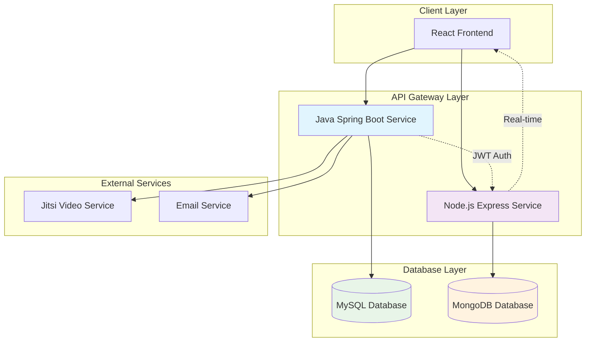

# Health Connect Hub - Backend

## Overview

The backend for Health Connect Hub consists of two main services: a Java Spring Boot application for core business logic and a Node.js Express server for real-time messaging and MongoDB integration. Together, they provide a robust API for the healthcare platform, handling authentication, data persistence, real-time communication, and video conferencing.

## System Architecture



## Architecture

### Java Spring Boot Service (HealthAppBackendJava)
- **Purpose**: Main REST API server handling user management, appointments, prescriptions, and authentication
- **Database**: MySQL with JPA/Hibernate
- **Authentication**: JWT tokens with Spring Security and WebAuthn support

### Node.js Service (MongoBackend)
- **Purpose**: Real-time messaging service and MongoDB data layer
- **Database**: MongoDB with Mongoose ODM
- **Features**: Socket.io for real-time chat, JWT authentication

## Tech Stack

### Java Spring Boot Service

#### Core Framework
- **Spring Boot** (v4.0.3) - Framework for building production-ready applications
- **Java** (v17) - Programming language
- **Maven** - Build automation and dependency management

#### Data Layer
- **Spring Data JPA** - Repository abstraction for JPA
- **Spring Data JDBC** - Repository abstraction for JDBC
- **MySQL Connector/J** - MySQL database driver
- **Hibernate** - ORM framework (included with Spring Data JPA)

#### Security
- **Spring Security** - Comprehensive security framework
- **Spring Security WebAuthn** - WebAuthn (FIDO2) authentication support
- **JJWT** (v0.12.6) - JSON Web Token library for Java

#### Web Layer
- **Spring Web MVC** - RESTful web services
- **Spring Boot Starter Validation** - Bean validation support

#### Testing
- **Spring Boot Test Starters** - Testing support for various Spring modules

### Node.js Service

#### Runtime
- **Node.js** - JavaScript runtime
- **Express** (v5.2.1) - Fast, unopinionated web framework

#### Database
- **MongoDB** - NoSQL document database
- **Mongoose** (v9.4.1) - MongoDB object modeling for Node.js

#### Authentication
- **jsonwebtoken** (v9.0.3) - JSON Web Token implementation

#### Real-time Communication
- **Socket.io** (v4.8.3) - Real-time bidirectional communication

#### Utilities
- **CORS** (v2.8.6) - Cross-Origin Resource Sharing middleware
- **dotenv** (v17.3.1) - Environment variable loading

## Features

### Java Service
- User registration and authentication
- JWT-based security
- WebAuthn support for passwordless authentication
- Appointment management
- Prescription handling
- Doctor and patient profiles
- RESTful API endpoints

### Node.js Service
- Real-time chat functionality
- Message persistence in MongoDB
- Socket.io integration for live communication
- JWT authentication for secure messaging

## Getting Started

### Prerequisites
- Java 17 (for Spring Boot service)
- Node.js (v18 or higher)
- MySQL database
- MongoDB database
- Maven (for Java builds)

### Java Spring Boot Service Setup

1. Navigate to the `HealthAppBackendJava` directory
2. Configure database connection in `application.properties`:
   ```properties
   spring.datasource.url=jdbc:mysql://localhost:3306/healthapp
   spring.datasource.username=your_username
   spring.datasource.password=your_password
   spring.jpa.hibernate.ddl-auto=update
   ```
3. Build and run:
   ```bash
   ./mvnw spring-boot:run
   ```

### Node.js Service Setup

1. Navigate to the `MongoBackend` directory
2. Install dependencies:
   ```bash
   npm install
   ```
3. Create a `.env` file:
   ```
   MONGODB_URI=mongodb://localhost:27017/healthapp
   JWT_SECRET=your_jwt_secret
   PORT=3001
   ```
4. Start the server:
   ```bash
   node server.js
   ```

## API Endpoints

### Java Service (Port 8080)
- `POST /api/auth/login` - User login
- `POST /api/auth/register` - User registration
- `GET /api/appointments` - Get user appointments
- `POST /api/appointments` - Create appointment
- `GET /api/doctors` - Get doctor list
- `GET /api/prescriptions` - Get prescriptions

### Node.js Service (Port 3001)
- `GET /api/messages` - Get chat messages
- `POST /api/messages` - Send message
- Socket.io events for real-time messaging

## Database Schema

### MySQL (Java Service)
- `users` - User accounts and profiles
- `doctors` - Doctor information
- `appointments` - Appointment bookings
- `prescriptions` - Medical prescriptions

### MongoDB (Node.js Service)
- `messages` - Chat messages collection
- `conversations` - Conversation threads

## Environment Variables

### Java Service
```properties
# Database
spring.datasource.url=jdbc:mysql://localhost:3306/healthapp
spring.datasource.username=db_user
spring.datasource.password=db_password

# JWT
jwt.secret=your_jwt_secret_key
jwt.expiration=86400000

# Server
server.port=8080
```

### Node.js Service
```env
MONGODB_URI=mongodb://localhost:27017/healthapp
JWT_SECRET=your_jwt_secret
PORT=3001
CORS_ORIGIN=http://localhost:5173
```

## Development

### Running Tests
```bash
# Java service
cd HealthAppBackendJava
./mvnw test

# Node.js service
cd MongoBackend
npm test
```

### Building for Production
```bash
# Java service
cd HealthAppBackendJava
./mvnw clean package

# Node.js service
cd MongoBackend
npm run build  # if build script exists
```

## Deployment

### Java Service
The Spring Boot application can be deployed as a JAR file:
```bash
java -jar target/HealthAppBackendJava-0.0.1-SNAPSHOT.jar
```

### Node.js Service
Deploy using PM2 or similar process manager:
```bash
npm install -g pm2
pm2 start server.js --name healthapp-mongo
```

## Contributing

1. Fork the repository
2. Create feature branches for each service
3. Follow coding standards for respective languages
4. Write tests for new features
5. Submit pull requests

## License

This project is licensed under the ISC License.